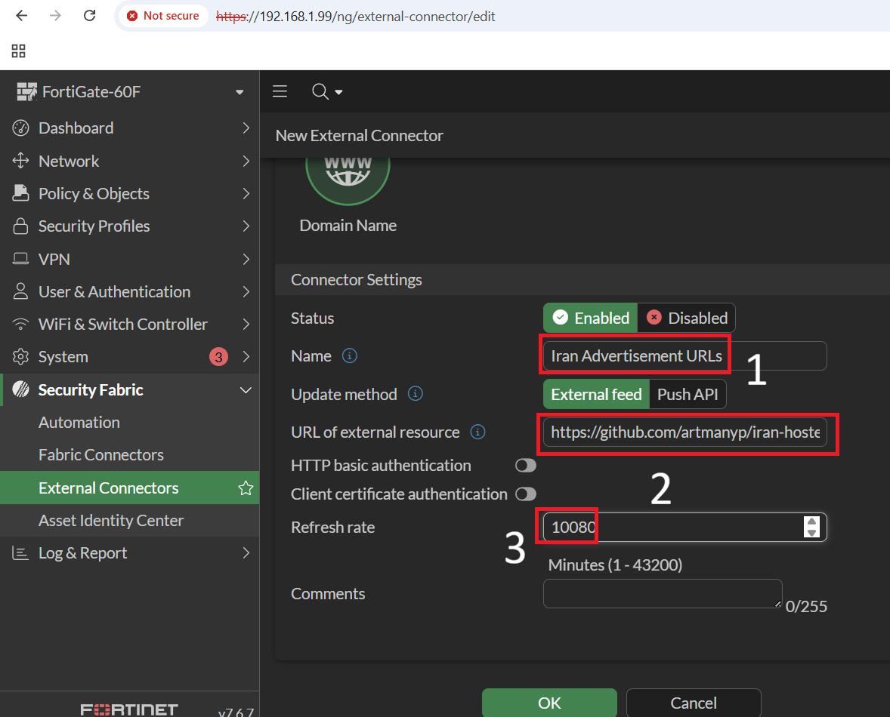
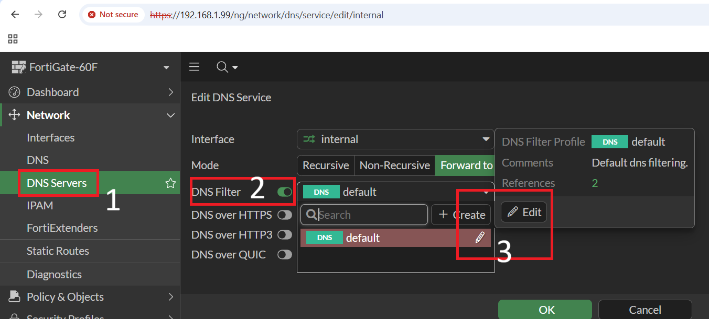
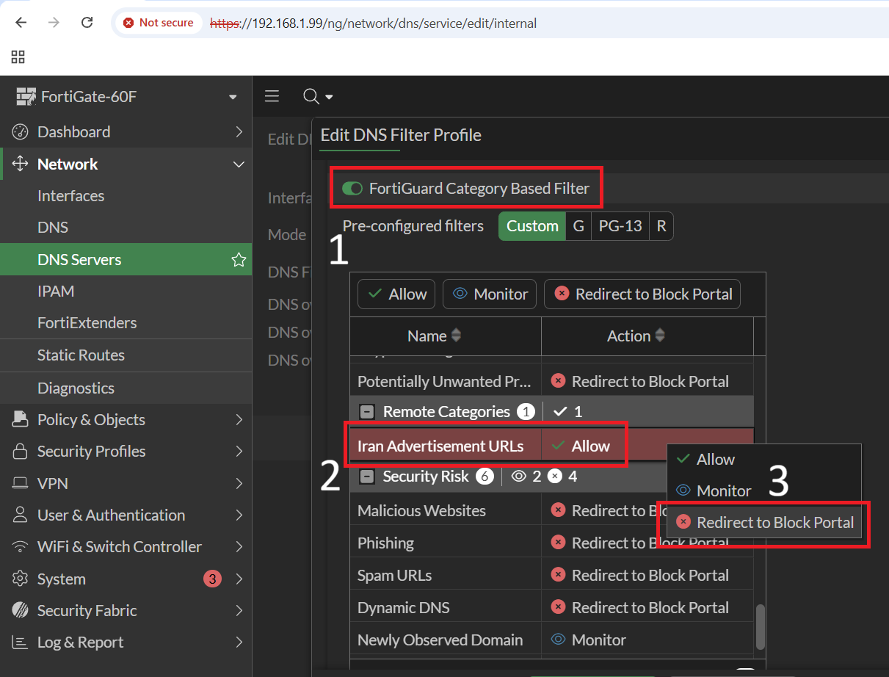

# Fortinet

A domain name external feed is a dynamic list that contains domains and is periodically updated from an external server. The list is stored in a text file format on an external server.

Domain name external feed connector can be created on the FortiManager, and that will be pushed to the FortiGate when the Firewall policy with the DNS filter is used.

## Routing

1. Go to Security Fabric -> External Connectors, and select Create New. The Create New Fabric Connector wizard is displayed.
2. Under External Feeds, select Domain Name and select Next.
3. Name: Create a Domain Name external connector 'Iran Advertisement URLs' with the list of URLs to be blocked in the DNS filter.
4. URL of external resource:

```INI
https://github.com/bootmortis/iran-hosted-domains/releases/latest/download/fortinet_domainset_ads.txt
```

5. Refresh rate: Use '100800' because Iran-hosted domains receive updates weekly.



4. You can either create a new DNS filter or edit the default rules; in this case, we will be modifying the default rules.



5. Set 'Iran Advertisement URLs' to 'Redirect to Block Portal' to block ads through FortiGate.



Keep in mind that with this method, you are blocking ads while all other sites remain allowed (provided you haven't set any other DNS filter). However, by using 'fortinet_domainset_other.txt' and adding it as another external connector, you will be able to manage all other Iranian websites according to your needs.